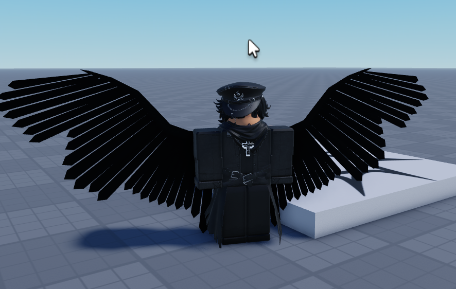
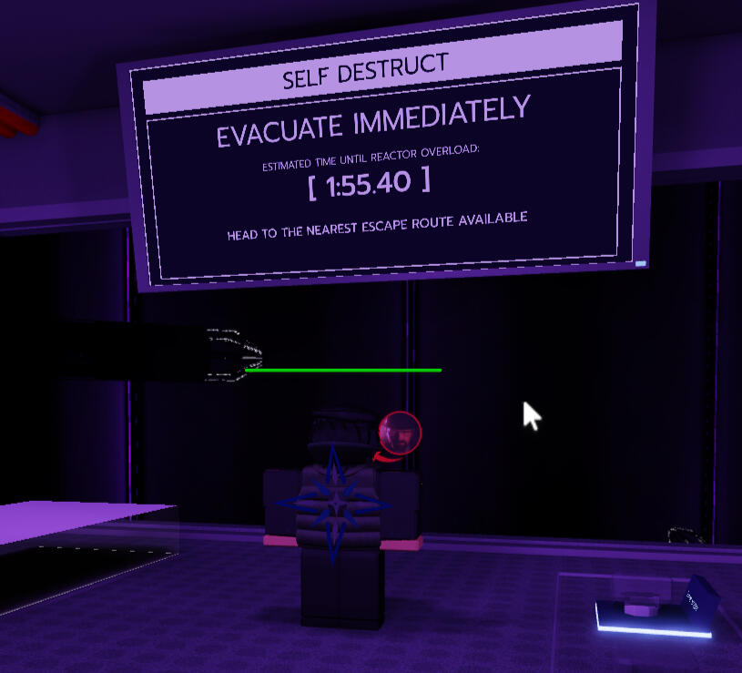
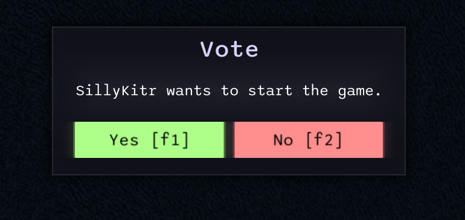
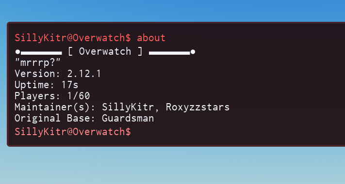
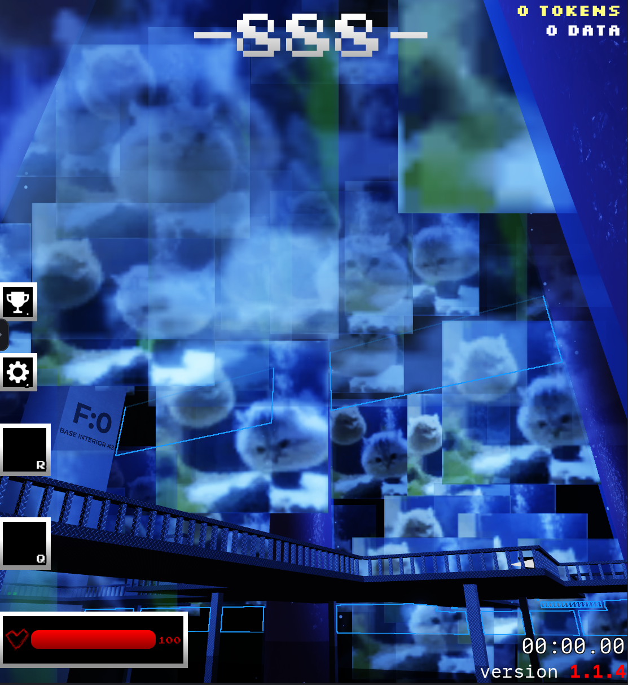
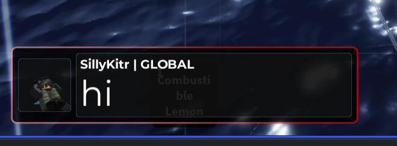
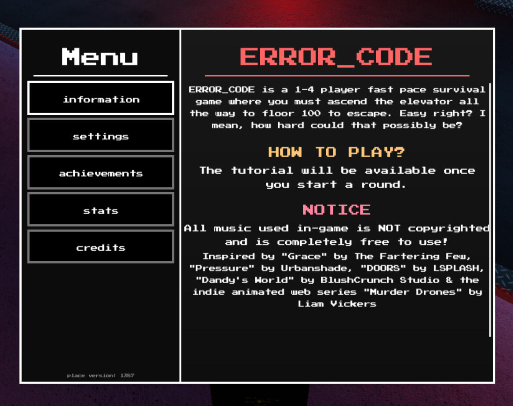
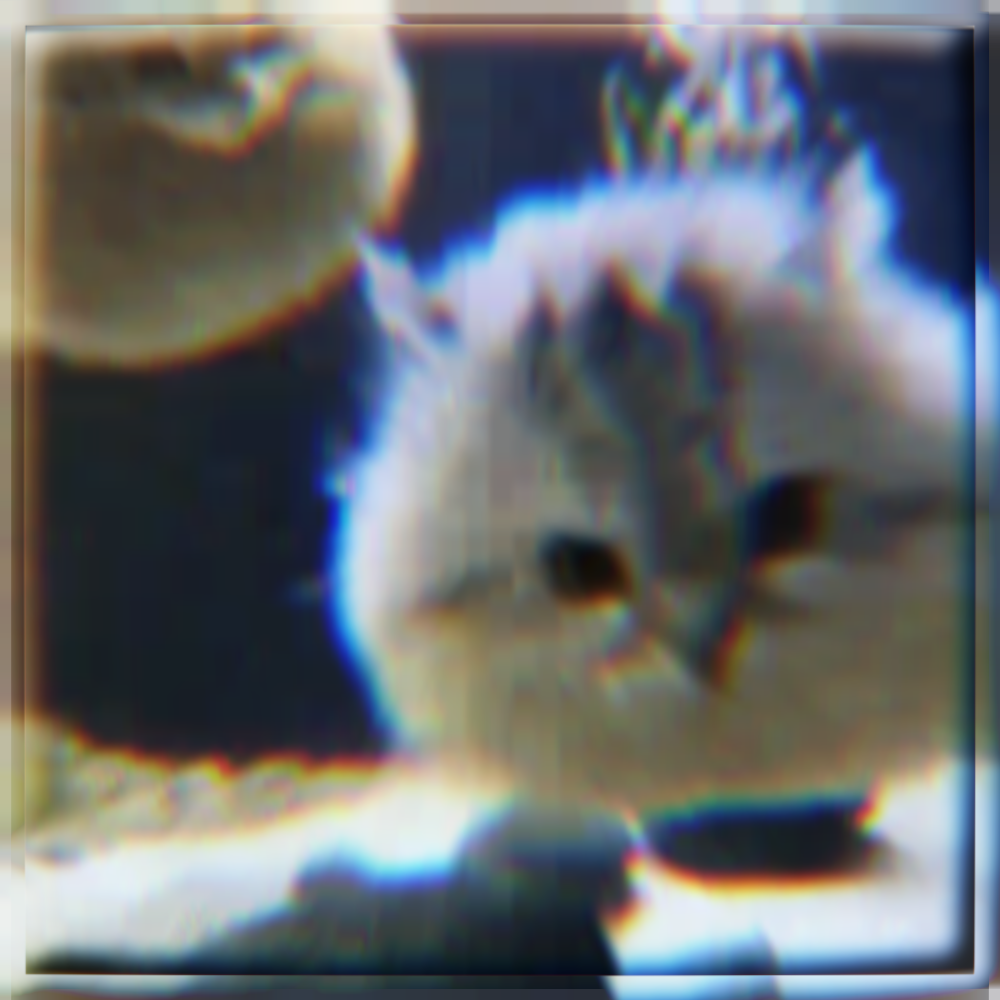

# Images Showcase

Hey there; here's a showcase of the stuff i'm most proud of!

---

## Image Showcase

## Editing Showcase

## Videos

---

**Portfolio by SillyKitr** | [GitHub](https://github.com/SillyKitr)